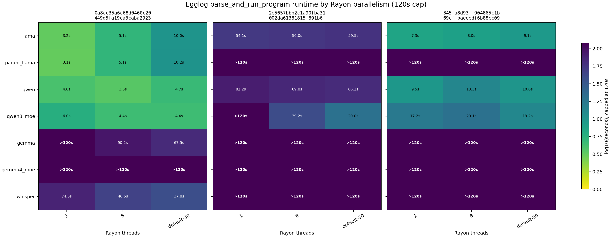

# Egglog Model Program Exports

Generated from `bump-egglog-2e5657b` on 2026-05-21.

## Artifacts

Programs live in `scratch/egglog_repros/programs/`.

| Model | Egglog program | Size | Lines |
| --- | --- | ---: | ---: |
| llama | `programs/llama.egg` | 455,570 bytes | 8,317 |
| paged_llama | `programs/paged_llama.egg` | 447,102 bytes | 8,196 |
| qwen | `programs/qwen.egg` | 485,356 bytes | 8,736 |
| qwen3_moe | `programs/qwen3_moe.egg` | 536,377 bytes | 9,371 |
| gemma | `programs/gemma.egg` | 938,513 bytes | 10,917 |
| gemma4_moe | `programs/gemma4_moe.egg` | 1,425,941 bytes | 13,686 |
| whisper | `programs/whisper.egg` | 489,506 bytes | 7,924 |

Exporter: `scratch/export_model_eggs`.

The exporter builds each example graph from its `examples/*/src/model.rs`, runs Luminal's loop-rolling prepass, and emits the same CUDA Egglog search program shape as `build_search_space::<CudaRuntime>()`, including CUDA's late memory-analysis pass. `llama` uses the example's `max_memory_mib(500)` setting; the other examples use default search-space options.

## Benchmark Method

The first benchmark pass used `RAYON_NUM_THREADS=1` and a `300s` timeout:

```bash
RAYON_NUM_THREADS=1 timeout 300s cargo run --release \
  --manifest-path /tmp/egglog_repro/Cargo.toml \
  --features <bench-feature> -- scratch/egglog_repros/programs/<model>.egg 0
```

The parallelism pass used a `120s` timeout and three Rayon modes:

| Rayon mode | Environment |
| --- | --- |
| `1` | `RAYON_NUM_THREADS=1` |
| `8` | `RAYON_NUM_THREADS=8` |
| `default-30` | `RAYON_NUM_THREADS` unset |

`default-30` was verified with `rayon::current_num_threads()` on this machine.

Each cell is one `parse_and_run_program` run. The 300s serial raw logs are in `scratch/egglog_repros/results/`. The 120s parallelism raw logs and CSV are in `scratch/egglog_repros/results_parallelism_120s/`.

Egglog versions:

| Egglog rev | Context |
| --- | --- |
| `0a8cc35a6c68d0460c20449d5fa19ca3caba2923` | Earlier comparison point |
| `2e5657bbb2c1a90fba31002da61381815f891b6f` | Revision pinned by the branch under test |
| `345fa8d93ff904865c1b69cffbaeeedf6b88cc09` | Issue 872 comparison revision |

## 300s Serial Results

Timeout is `>300s`.

| Model | `0a8cc35a6c68d0460c20449d5fa19ca3caba2923` | `2e5657bbb2c1a90fba31002da61381815f891b6f` | `345fa8d93ff904865c1b69cffbaeeedf6b88cc09` | `345fa8d93ff904865c1b69cffbaeeedf6b88cc09` vs `2e5657bbb2c1a90fba31002da61381815f891b6f` |
| --- | ---: | ---: | ---: | ---: |
| llama | 3.154s | 54.319s | 7.413s | 7.3x faster |
| paged_llama | 3.095s | >300s | >300s | no finish |
| qwen | 3.975s | 82.324s | 9.552s | 8.6x faster |
| qwen3_moe | 5.988s | 130.182s | 17.260s | 7.5x faster |
| gemma | 183.284s | >300s | >300s | no finish |
| gemma4_moe | >300s | >300s | >300s | no finish |
| whisper | 74.422s | >300s | >300s | no finish |

## 120s Parallelism Results



Timeout is `>120s`.

| Model | Egglog rev | threads=1 | threads=8 | threads=default-30 |
| --- | --- | ---: | ---: | ---: |
| llama | `0a8cc35a6c68d0460c20449d5fa19ca3caba2923` | 3.157s | 5.144s | 9.983s |
| llama | `2e5657bbb2c1a90fba31002da61381815f891b6f` | 54.098s | 56.034s | 59.522s |
| llama | `345fa8d93ff904865c1b69cffbaeeedf6b88cc09` | 7.323s | 7.950s | 9.110s |
| paged_llama | `0a8cc35a6c68d0460c20449d5fa19ca3caba2923` | 3.086s | 5.105s | 10.178s |
| paged_llama | `2e5657bbb2c1a90fba31002da61381815f891b6f` | >120s | >120s | >120s |
| paged_llama | `345fa8d93ff904865c1b69cffbaeeedf6b88cc09` | >120s | >120s | >120s |
| qwen | `0a8cc35a6c68d0460c20449d5fa19ca3caba2923` | 3.985s | 3.480s | 4.714s |
| qwen | `2e5657bbb2c1a90fba31002da61381815f891b6f` | 82.178s | 69.844s | 66.060s |
| qwen | `345fa8d93ff904865c1b69cffbaeeedf6b88cc09` | 9.490s | 13.304s | 9.968s |
| qwen3_moe | `0a8cc35a6c68d0460c20449d5fa19ca3caba2923` | 5.990s | 4.406s | 4.413s |
| qwen3_moe | `2e5657bbb2c1a90fba31002da61381815f891b6f` | >120s | 39.169s | 20.014s |
| qwen3_moe | `345fa8d93ff904865c1b69cffbaeeedf6b88cc09` | 17.183s | 20.139s | 13.194s |
| gemma | `0a8cc35a6c68d0460c20449d5fa19ca3caba2923` | >120s | 90.171s | 67.522s |
| gemma | `2e5657bbb2c1a90fba31002da61381815f891b6f` | >120s | >120s | >120s |
| gemma | `345fa8d93ff904865c1b69cffbaeeedf6b88cc09` | >120s | >120s | >120s |
| gemma4_moe | `0a8cc35a6c68d0460c20449d5fa19ca3caba2923` | >120s | >120s | >120s |
| gemma4_moe | `2e5657bbb2c1a90fba31002da61381815f891b6f` | >120s | >120s | >120s |
| gemma4_moe | `345fa8d93ff904865c1b69cffbaeeedf6b88cc09` | >120s | >120s | >120s |
| whisper | `0a8cc35a6c68d0460c20449d5fa19ca3caba2923` | 74.485s | 46.531s | 37.806s |
| whisper | `2e5657bbb2c1a90fba31002da61381815f891b6f` | >120s | >120s | >120s |
| whisper | `345fa8d93ff904865c1b69cffbaeeedf6b88cc09` | >120s | >120s | >120s |

## Takeaway

`345fa8d93ff904865c1b69cffbaeeedf6b88cc09` confirms a substantial recovery for llama, qwen, and qwen3_moe versus `2e5657bbb2c1a90fba31002da61381815f891b6f`, but the recovery is not consistent across the requested Rust examples. Paged llama, both Gemma programs, and Whisper still fail to complete under the 120s cap on `345fa8d93ff904865c1b69cffbaeeedf6b88cc09`.

Parallelism helps some larger cases, especially qwen3_moe on `2e5657bbb2c1a90fba31002da61381815f891b6f`, gemma on `0a8cc35a6c68d0460c20449d5fa19ca3caba2923`, and whisper on `0a8cc35a6c68d0460c20449d5fa19ca3caba2923`. It hurts or barely helps smaller llama and paged_llama cases, where serial remains fastest for `0a8cc35a6c68d0460c20449d5fa19ca3caba2923` and `345fa8d93ff904865c1b69cffbaeeedf6b88cc09`.
